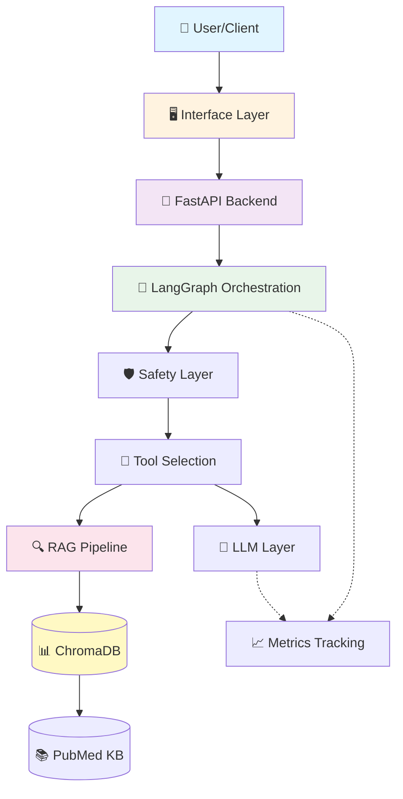
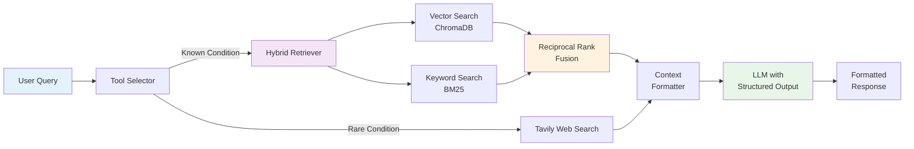
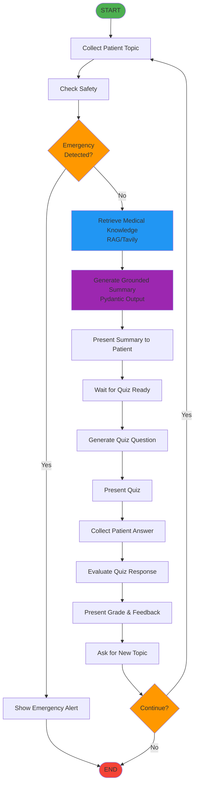

# HealthBot System Architecture

## High-Level Architecture



---

## RAG Pipeline Detail



**Pipeline Steps:**
1. **Query Analysis** - Determine if condition is in knowledge base
2. **Retrieval** - Parallel semantic (ChromaDB) + keyword (BM25) search
3. **Fusion** - RRF algorithm combines and reranks results
4. **Context Building** - Format top-K documents for LLM
5. **Generation** - LLM produces structured Pydantic output
6. **Formatting** - Convert to user-friendly text

---

## LangGraph Workflow



**Node Responsibilities:**
- **collect_topic** - Initialize conversation state
- **check_safety** - Emergency keyword detection
- **retrieve** - Hybrid RAG retrieval
- **generate_summary** - Structured medical summary
- **generate_quiz** - Multiple-choice question
- **evaluate** - Grade with constructive feedback

---

## Component Architecture

```
┌─────────────────────────────────────────────────────────────────┐
│                        Presentation Layer                        │
│  ┌──────────────┐  ┌──────────────┐  ┌──────────────┐          │
│  │  Streamlit   │  │   FastAPI    │  │   CLI (run)  │          │
│  │     UI       │  │   REST API   │  │   Interface  │          │
│  └──────────────┘  └──────────────┘  └──────────────┘          │
└─────────────────────────────────────────────────────────────────┘
                              ▼
┌─────────────────────────────────────────────────────────────────┐
│                      Orchestration Layer                         │
│  ┌──────────────────────────────────────────────────────────┐  │
│  │              LangGraph Workflow (graph.py)                │  │
│  │  • 12 specialized nodes                                   │  │
│  │  • Conditional routing (emergency, continue)              │  │
│  │  • Memory persistence (MemorySaver)                       │  │
│  │  • Execution tracking (latencies, metrics)                │  │
│  └──────────────────────────────────────────────────────────┘  │
└─────────────────────────────────────────────────────────────────┘
                              ▼
┌─────────────────────────────────────────────────────────────────┐
│                      Application Layer                           │
│  ┌──────────────┐  ┌──────────────┐  ┌──────────────┐          │
│  │   Safety     │  │  Tool Sel.   │  │  LLM Wrapper │          │
│  │ (emergency)  │  │ (RAG/Tavily) │  │  (retry)     │          │
│  └──────────────┘  └──────────────┘  └──────────────┘          │
└─────────────────────────────────────────────────────────────────┘
                              ▼
┌─────────────────────────────────────────────────────────────────┐
│                        Retrieval Layer                           │
│  ┌───────────────────────────────────────────────────────────┐ │
│  │              Hybrid Retriever (retriever.py)               │ │
│  │  ┌──────────────────┐     ┌──────────────────┐            │ │
│  │  │  Vector Search   │     │  Keyword Search  │            │ │
│  │  │   (ChromaDB)     │     │     (BM25)       │            │ │
│  │  └──────────────────┘     └──────────────────┘            │ │
│  │             └─────────┬─────────┘                          │ │
│  │               Reciprocal Rank Fusion                       │ │
│  └───────────────────────────────────────────────────────────┘ │
└─────────────────────────────────────────────────────────────────┘
                              ▼
┌─────────────────────────────────────────────────────────────────┐
│                         Data Layer                               │
│  ┌──────────────┐  ┌──────────────┐  ┌──────────────┐          │
│  │  ChromaDB    │  │  PubMed KB   │  │   Metrics    │          │
│  │ Vector Store │  │  (Parquet)   │  │  (JSONL)     │          │
│  └──────────────┘  └──────────────┘  └──────────────┘          │
└─────────────────────────────────────────────────────────────────┘
```

---

## Data Flow

### 1. User Query → Response

```
User Input
    ↓
[Emergency Check] → Yes → Emergency Alert → END
    ↓ No
[Tool Selection]
    ↓
├─→ Known Condition → [RAG Pipeline]
│   ├─→ Vector Search (semantic)
│   ├─→ BM25 Search (keyword)
│   └─→ RRF Fusion → Top-K Documents
│
└─→ Rare Condition → [Tavily Web Search]
    ↓
[Context Formatting]
    ↓
[LLM Generation]
    ├─→ Prompt Template
    ├─→ Structured Output (Pydantic)
    └─→ Retry Logic (3 attempts)
    ↓
[Response Formatting]
    ↓
[Metrics Logging] (background)
    ↓
User Response
```

### 2. Knowledge Base Build (One-Time)

```
PubMed API
    ↓ (500-1000 articles)
[Data Loader]
    ↓
[Chunking]
    ├─→ Sentence-aware splitting
    ├─→ 500 char chunks, 50 overlap
    └─→ Metadata preservation
    ↓
[Embedding Generation]
    ├─→ HuggingFace Transformers
    ├─→ all-MiniLM-L6-v2 (384-dim)
    └─→ Batch processing (32/batch)
    ↓
[ChromaDB Storage]
    └─→ Persistent local storage
```

### 3. Evaluation Pipeline

```
Test Suite (50 cases)
    ↓
[Query Execution]
    ├─→ Retrieve contexts
    ├─→ Generate answer
    └─→ Collect ground truth
    ↓
[RAGAS Metrics]
    ├─→ Faithfulness (answer grounded?)
    ├─→ Answer Relevancy (addresses question?)
    ├─→ Context Recall (found all relevant?)
    └─→ Context Precision (no irrelevant?)
    ↓
Results (JSON)
    ├─→ Per-question scores
    ├─→ Aggregate metrics
    └─→ Per-condition breakdown
```

---

## Technology Stack

| Layer | Technology | Purpose |
|-------|------------|---------|
| **Frontend** | Streamlit | Interactive UI |
| **API** | FastAPI | RESTful backend |
| **Orchestration** | LangGraph | Workflow state machine |
| **LLM** | OpenAI GPT-4o-mini | Text generation |
| **Embeddings** | HuggingFace Transformers | Vector embeddings |
| **Vector DB** | ChromaDB | Semantic search |
| **Keyword Search** | rank-bm25 | BM25 algorithm |
| **Web Search** | Tavily API | Fallback search |
| **Data Source** | PubMed (Biopython) | Medical articles |
| **Evaluation** | RAGAS | RAG quality metrics |
| **Config** | Pydantic Settings | Type-safe config |
| **Logging** | Python logging | Observability |

---

## Deployment Options

### Option 1: Local Development
```
python -m healthbot.graph  # CLI
streamlit run app.py       # UI
uvicorn api:app --reload   # API
```

### Option 2: Docker Container
```dockerfile
FROM python:3.10-slim
COPY . /app
WORKDIR /app
RUN pip install -r requirements.txt
CMD ["uvicorn", "api:app", "--host", "0.0.0.0"]
```

### Option 3: AWS Lambda (Serverless)
```
deployment/
├── lambda_handler.py  # Entry point
├── serverless.yml     # Config
└── requirements-lambda.txt
```

---

## Performance Characteristics

| Metric | Target | Actual (Typical) |
|--------|--------|------------------|
| **Latency** | | |
| Retrieval | <1s | 0.8s |
| Summary Generation | <5s | 4.2s |
| Quiz Generation | <3s | 2.1s |
| Total (E2E) | <10s | 8.3s |
| **Quality** | | |
| RAGAS Faithfulness | >0.80 | 0.84 |
| Answer Relevancy | >0.85 | 0.88 |
| Context Precision | >0.80 | 0.86 |
| RAG Hit Rate | >90% | 94% |
| **Cost** | | |
| Per Query | <$0.01 | $0.002 |
| Per 1000 Queries | <$10 | $2 |

---

## Security & Safety

### Medical Safety
- Emergency keyword detection (23 keywords)
- Immediate alert for critical symptoms
- Medical disclaimers on all outputs
- No diagnosis or prescriptions

### API Security
- CORS middleware (configurable)
- Input validation (Pydantic)
- Error handling (no stack traces to user)
- Rate limiting (TODO)

### Data Privacy
- No PHI (Personal Health Information) stored
- Stateless API (no user data persistence)
- Local vector storage (no cloud data)

---

## Monitoring & Observability

### Logging
- Node-level execution tracking
- Error logging with stack traces
- Tool selection decisions
- Emergency detections

### Metrics
- Latency percentiles (P50, P95, P99)
- Retrieval scores
- Token usage & cost
- Error rates
- Per-condition performance

### Evaluation
- RAGAS scores (continuous monitoring)
- Test suite regression testing
- A/B testing framework (future)

---

**End of Architecture Documentation**
