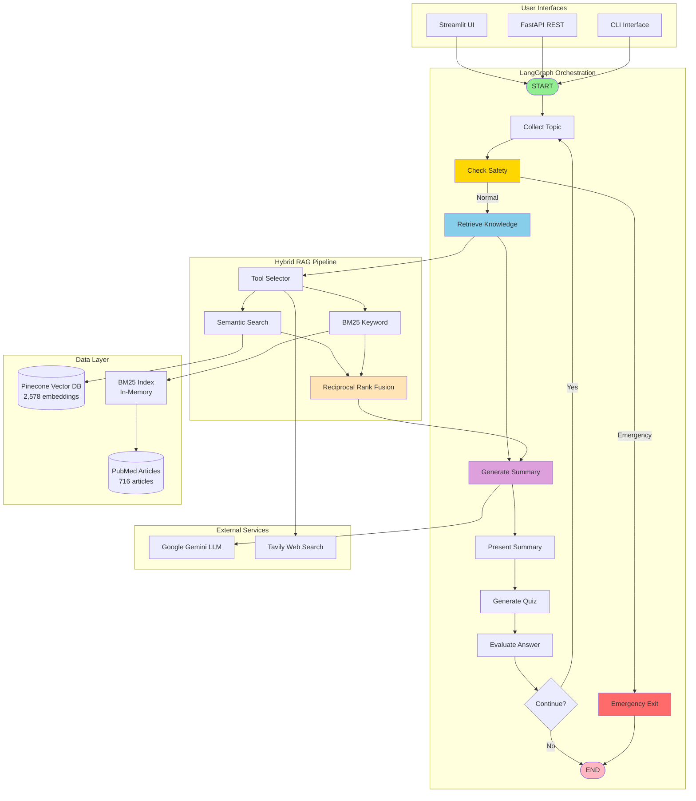
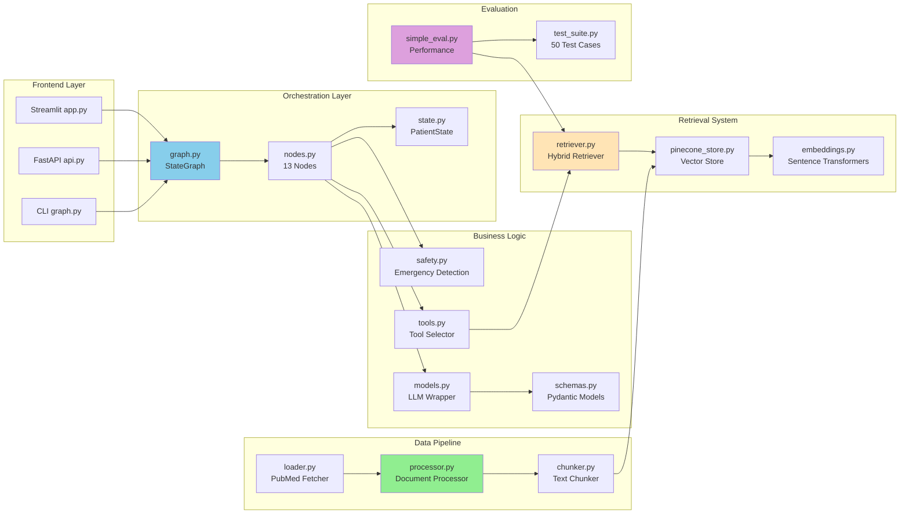
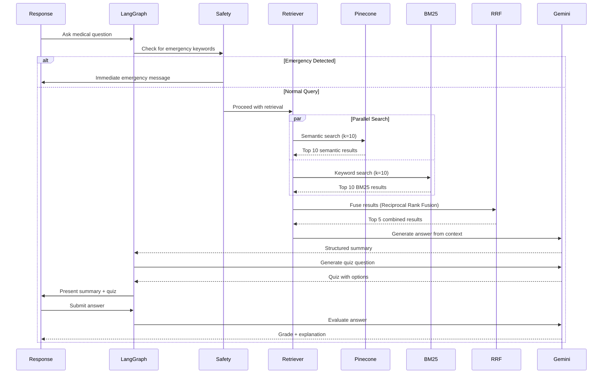
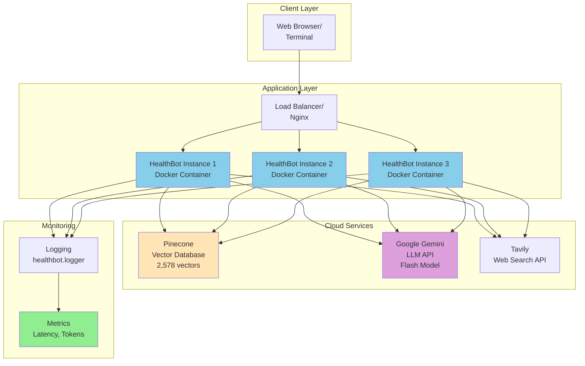
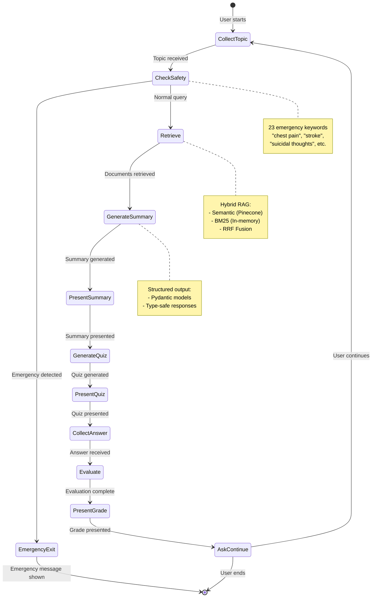

# HealthBot System Architecture

## High-Level System Architecture



---

## Detailed Component Architecture



---

## Data Flow: Query to Response



---

## Deployment Architecture



---

## State Management



---

## Hybrid RAG Architecture (Detailed)

```mermaid
graph TD
    QUERY[User Query:<br/>"What are diabetes symptoms?"]
    
    subgraph "Embedding Pipeline"
        EMB1[sentence-transformers/<br/>all-MiniLM-L6-v2]
        VEC[384-dim Vector]
    end
    
    subgraph "Semantic Search Path"
        PINE[(Pinecone Index<br/>2,578 vectors)]
        SEM_RES[Top 10 Semantic<br/>Cosine Similarity]
    end
    
    subgraph "Keyword Search Path"
        TOK[Tokenize Query<br/>["diabetes", "symptoms"]]
        BM25_IDX[BM25Okapi Index<br/>2,578 documents]
        BM25_RES[Top 10 BM25<br/>Term Frequency]
    end
    
    subgraph "Fusion Layer"
        RRF_CALC[RRF Score = Σ 1/(60 + rank)]
        MERGE[Deduplicate & Rerank]
        TOP5[Top 5 Combined Results]
    end
    
    subgraph "Context Preparation"
        FORMAT[Format Sources<br/>[Source 1] Title<br/>PMID | Condition<br/>Text...]
        CTX[RAG Context String]
    end
    
    QUERY --> EMB1
    QUERY --> TOK
    
    EMB1 --> VEC
    VEC --> PINE
    PINE --> SEM_RES
    
    TOK --> BM25_IDX
    BM25_IDX --> BM25_RES
    
    SEM_RES --> RRF_CALC
    BM25_RES --> RRF_CALC
    
    RRF_CALC --> MERGE
    MERGE --> TOP5
    TOP5 --> FORMAT
    FORMAT --> CTX
    
    CTX --> LLM[Google Gemini<br/>Generate Answer]

    style QUERY fill:#90EE90
    style PINE fill:#FFE4B5
    style RRF_CALC fill:#FFD700
    style LLM fill:#DDA0DD
```

---

## File Organization

```
healthbot/
├── 📁 Core Orchestration
│   ├── graph.py          # LangGraph workflow (13 nodes)
│   ├── nodes.py          # Node implementations
│   ├── state.py          # PatientState TypedDict
│   └── schemas.py        # Pydantic models
│
├── 📁 Business Logic
│   ├── safety.py         # Emergency detection
│   ├── tools.py          # Tool selector (RAG/Tavily)
│   ├── models.py         # LLM wrapper with retry
│   ├── prompts.py        # System prompts
│   └── logger.py         # Logging & decorators
│
├── 📁 Retrieval System
│   ├── retrieval/
│   │   ├── retriever.py      # Hybrid retriever (main)
│   │   ├── pinecone_store.py # Pinecone client
│   │   ├── embeddings.py     # Embedding manager
│   │   └── README.md         # Retrieval docs
│
├── 📁 Data Pipeline
│   ├── data/
│   │   ├── loader.py         # PubMed fetcher
│   │   ├── processor.py      # Document processor
│   │   └── chunker.py        # Text chunker
│
├── 📁 Evaluation
│   ├── evaluation/
│   │   ├── simple_eval.py    # Performance evaluator
│   │   ├── test_suite.py     # 50 test cases
│   │   └── ragas_eval.py     # RAGAS integration
│
└── 📁 Configuration
    └── config.py         # Pydantic settings
```

---

## Technology Stack

| Layer | Technology | Purpose |
|-------|------------|---------|
| **Orchestration** | LangGraph 0.2.19 | Stateful workflow with conditional routing |
| **LLM** | Google Gemini Flash | Text generation with structured outputs |
| **Vector DB** | Pinecone | Cloud-native semantic search (2,578 vectors) |
| **Embeddings** | sentence-transformers | 384-dim embeddings (all-MiniLM-L6-v2) |
| **Keyword Search** | rank-bm25 (BM25Okapi) | Lexical matching for medical terms |
| **Fusion** | RRF (Reciprocal Rank Fusion) | Combines semantic + BM25 results |
| **Web Search** | Tavily API | Fallback for rare conditions |
| **Data Source** | PubMed (Biopython) | 716 medical articles via Entrez API |
| **API Framework** | FastAPI 0.111.0 | RESTful backend (5 endpoints) |
| **UI Framework** | Streamlit 1.35.0 | Interactive chat interface |
| **Config** | Pydantic Settings | Type-safe environment config |
| **Logging** | Python logging | Structured logs with decorators |

---

## Performance Characteristics

### Measured Latencies (10-case evaluation)
- **Average**: 418ms
- **Min**: 280ms
- **Max**: 1,452ms (cold start with model loading)
- **Typical**: 300-350ms (after warm-up)

### Breakdown (Estimated)
```
Total: ~400ms
├─ Embedding: ~50ms (CPU, sentence-transformers)
├─ Pinecone Query: ~200ms (network + search)
├─ BM25 Search: ~20ms (in-memory)
├─ RRF Fusion: ~10ms (computation)
└─ Context Formatting: ~10ms
```

### Scalability
- **Stateless Containers**: Each instance is independent (no shared state)
- **Horizontal Scaling**: 1-1000 instances (limited only by cloud quotas)
- **Concurrency**: 10+ queries/sec per instance (limited by Pinecone throughput)
- **Cost**: Free tier supports ~1,500 queries/day (Gemini limit)

---

## Security & Safety

### Medical Safety
- **Emergency Detection**: 23 critical keywords → immediate exit
- **Disclaimers**: Shown on every response
- **Scope Limitations**: Educational only, no diagnosis/prescriptions

### Data Privacy
- **No PII Storage**: Queries not persisted
- **Stateless Design**: No conversation history stored server-side
- **Cloud Services**: Pinecone (embeddings only), Gemini (ephemeral)

### API Security
- **Rate Limiting**: Configurable per endpoint
- **CORS**: Restricted origins in production
- **API Keys**: Environment variables, never committed

---

**Generated**: 2026-07-29  
**Version**: 1.0.0  
**For**: Interview presentations, system understanding, onboarding
